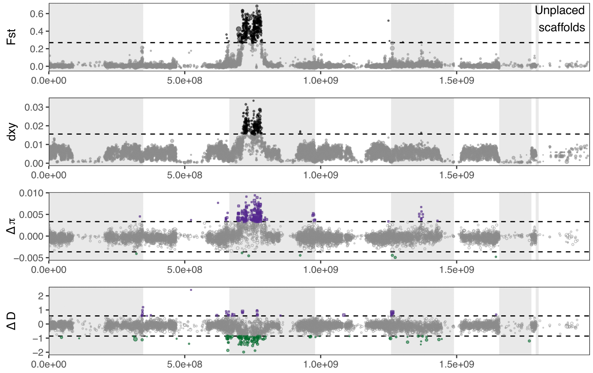
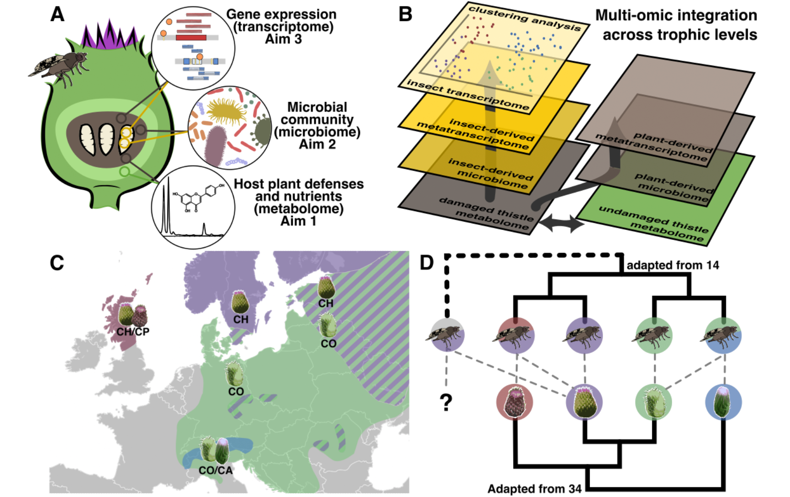
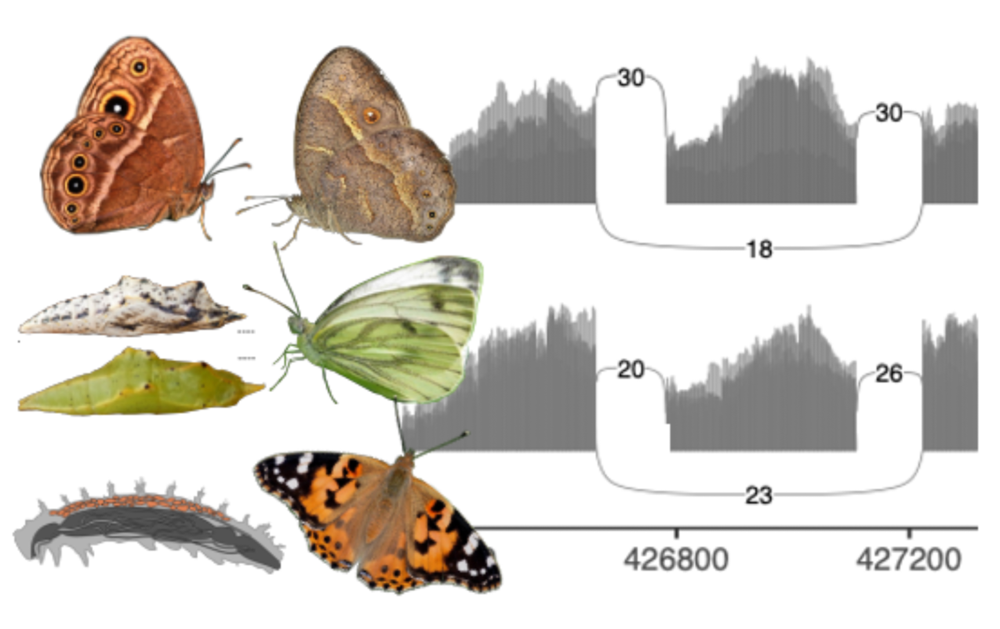

# My Projects
[← Back to Home](README.md)

---

## Genomics and Transcriptomics of Host Repertoire
<table>
  <tr>
    <td width="40%">
      
    </td>
    <td width="60%" valign="top">
      
A major goal of my research has been to understand the genomic and transcriptomic mechanisms underlying how insects use their host plants, and how this changes as environments change over shorter and longer evolutionary time. We use the peacock fly (_Tephritis conura_) and butterflies (_e.g., Polygonia c. album, Vanessa cardui_) to study the determinants of host repertoire (_i.e._ diet breadht), exploring how structural changes in the genome like inversions and repetitive content can help maintain adaptations and host associated divergence in the face of ongoing gene flow. 

      <a href="https://github.com/yourlink">View Repository</a>
    </td>
  </tr>
</table>

---

## Multitrophic Multi-omics
<table>
  <tr>
    <td width="40%">
      
    </td>
    <td width="60%" valign="top">
      
I am interested in the multitrophic drivers of host use, specifically how microbes modfiy interactions between insects and plants. Insect host use depends not only on characteristics of the colonizing insect, but interactions with organisms at multiple trophic levels, including the chemical and nutritional landscape of the host plant and its associated microbial communities. Without a mechanistic understanding of the interaction between plant, insect, and microbes, it is impossible to determine the ecological pressures that promote host-associated differentiation, utlimately impacting patterns of biodiversity. I am especiallyl interested in these multitrophic interactions in cases of recent host expansion (_i.e.,_ increased generalization). Modern techniques allow for integration of -omic data across multiple data types. For organisms with tightly linked life histories, like highly specialized insects and their plant hosts, this presents the novel opportunity to use multi-omic approaches to link data not only within an organism, but across trophic levels. 

     <a href="https://github.com/yourlink">View Repository</a>
    </td>
  </tr>
</table>

## Transcriptional and post-transcriptional plasticity 
<table>
  <tr>
    <td width="40%">
      
    </td>
    <td width="60%" valign="top">
      
I aim to uncover teh molecular mechanisms underlying how oroganisms interact with a changing environment, focusing on the role of transcriptional plastiicty in mediating phenotpyic plasticity. Primarily using bulk- RNAseq, we study how gene expression and alternative splicing changes when _e.g.,_ an insect swithces host plants, and how this transcriptional plastiicty evolves. Furthermore, I have advanced research into the molecular mechanisms of seasonal plasticity, particularly in butterflies like _Bicyclus anynana_ and _Pieris napi_. I previously investigated how alternative pslicing allows organisms to cope with seasonal changes, finding tha tthe mechanisms regulating splicing exhibit signatures of tighter genetic constraints than those regulating locus expression, potentially limiting how species adapt to rapid environmental change. 

      <a href="https://github.com/yourlink">View Repository</a>
    </td>
  </tr>
</table>

---

## Evolutionary Traps and Persistent Maladaptation
<table>
  <tr>
    <td width="40%">
      
    </td>
    <td width="60%" valign="top">
      
 My doctoral research explored the chemical and behavioral ecology of novel interactions. I focused on evolutionary traps, where an organism's evolved and formerly adaptive hbehavioral cues lead it to select poor-quality resources after environmental change. I stuided native insects that are attracted to invasive plants that are actually lethal to their offspring. This work explored the behavioral, phenotypic and genetic variation that allows a  population to evolve away from these traps or keep them "stuck" in a 
      <a href="https://github.com/yourlink">View Repository</a>
    </td>
  </tr>
</table>

---
