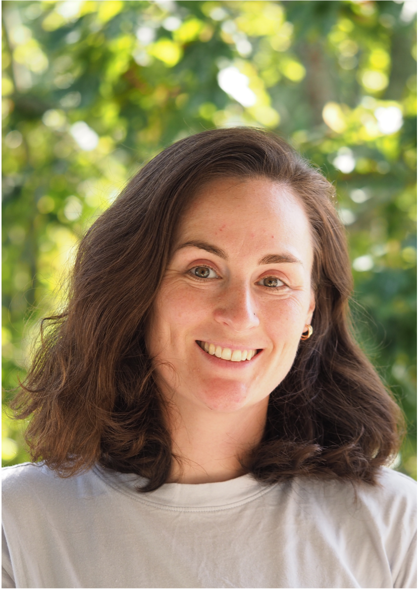

# The Steward Lab

## PI: Rachel A. Steward 

I am a researcher in the Biodiversity and Evolution Division within the Biology Department at Lund University, Sweden. My work sits at the intersection of evolutionary genomics and ecology, with a primary focus on how organisms adapt to novel or changing environments. My research is currently funded by several grants, including from the Swedish Research Council (2025–2029). 

My research explores the genetic mechanisms that allow species to transition to new ecological niches and that mediate multiple host use by herbivorous insects (i.e., diet plasticity). I am PI on a project exploring the genomic and transcriptomic architecture of how species broaden their niches using peacock flies specializing on the buds of different thistle species. In particular, I am investigating the role of repetitive content and structural variants in mediating transcriptional divergence and plasticity. As part of this research, I also aim to uncover how the plant chemical landscape  and microbial associations mediate host-associated speciation and multiple host use. 

---

### Navigation
[View Lab Projects](projects.md) | [LU Research Portal](https://portal.research.lu.se/en/persons/rachel-steward/) | [Contact Me](mailto:rachel.steward@biol.lu.se)
